## 1.1 控制智慧实验

### 1.1.1 实验内容
- 使用蜂巢套件控制智慧教室硬件。

### 1.1.2 实验目的
- 掌握蜂巢套件与智慧教室的联动过程。

### 1.1.3 实验环境
实验所需要硬件及软件如下：

**表 1.1.1 实验所需要硬件及软件**

| 序号 | 名称                | 数量 | 备注                   |
|----|-------------------|----|----------------------|
| 1  | PC机               | 1台 | PC机安装有MDK5和ST_LINK驱动 |
| 2  | STM32底座           | 2个 |                      |
| 3  | WiFi模块            | 1个 |                      |
| 4  | LED模块             | 1个 |                      |
| 5  | ST_LINK下载器        | 1个 |                      |
| 6  | ST_LINK下载器连接线     | 1根 |                      |
| 7  | OneNET平台显示PM2.5实验 | 1份 |                      |

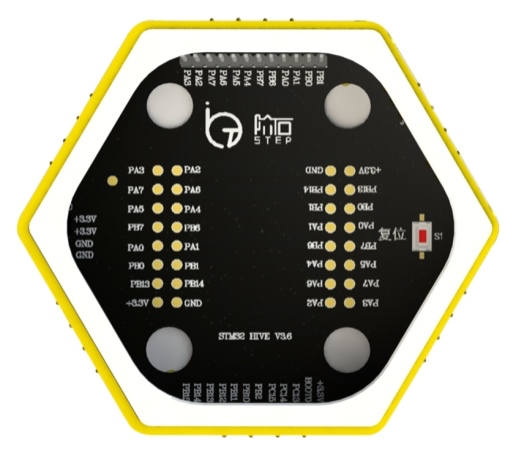

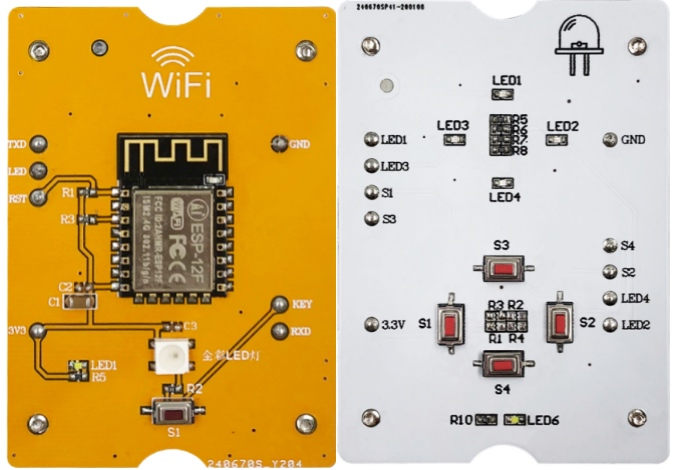

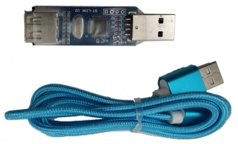

### 1.1.4.实验原理

- 1. WIFI技术基本概念
     - WIFI英语全称是Wireless Fidelity，中文译成无线保真。WIFI是建立连接和进行通讯的手段，它对应一套通讯的规则，保证让两个节点能互相连接，设备连接建立后，通过TCP/IP和UDP等协议，传输数据，连接互联网络。WIFI模块的STA模式和AP模式。

    - AP模式：Access Point，提供无线接入服务，允许其它无线设备接入，提供数据访问，一般的无线路由/网桥工作在该模式下。AP和AP之间允许相互连接。Sta模式（SP模式）：Station类似于无线终端，sta本身并不接受无线的接入，它可以连接到AP，一般无线网卡即工作在该模式。对照表如下

表 1.1.2 AP模式和SP模式对照表

| 分类   | AP模式 | SP模式 |
|------|------|------|
| 接入网络 | 接受   | 不接受  |
| 网卡   | 需要   | 不需要  |
| 终端   | 有线   | 无线   |

 - 2.WiFi模块原理图
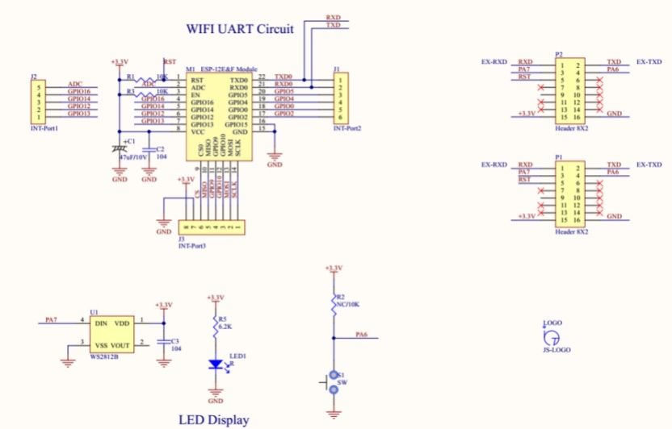

- 3.RS485总线标准

    - RS485采用平衡发送和差分接收方式实现通信：发送端将串行口的ttl电平信号转换成差分信号a,b两路输出，经过线缆传输之后在接收端将差分信号还原成ttl电平信号。由于传输线通常使用双绞线，又是差分传输，所以有极强的抗共模干扰的能力，总线收发器灵敏度很高，可以检测到低至200mv电压。故传输信号在千米之外都是可以恢复。rs-485最大的通信距离约为1219m，最大传输速率为10mb/s，传输速率与传输距离成反比，在100kb/s的传输速率下，才可以达到最大的通信距离，如果需传输更长的距离，需要加485中继器。rs-485采用半双工工作方式，支持多点数据通信。rs-485总线网络拓扑一般采用终端匹配的总线型结构。即采用一条总线将各个节点串接起来，不支持环形或星型网络。如果需要使用星型结构，就必须使用485中继器或者485集线器才可以。rs-485总线一般最大支持32个节点，如果使用特制的485芯片，可以达到128个或者256个节点，最大的可以支持到400个节点。
- 4.UART与RS-485性能对比

    - **抗干扰性**：RS485 接口是采用平衡驱动器和差分接收器的组合，抗噪声干扰性好。RS232 接口使用一根信号线和一根信号返回线而构成共地的传输形式，这种共地传输容易产生共模干扰。
    - **传输距离**：RS485 接口的最大传输距离标准值为 1200 米（9600bps 时），实际上可达 3000 米。RS232 传输距离有限，最大传输距离标准值为 50 米，实际上也只能用在 15 米左右。
    - **通信能力**：RS-485 接口在总线上是允许连接多达128个收发器，用户可以利用单一的 RS-485 接口方便地建立起设备网络。RS-232只允许一对一通信。
    - **传输速率**：RS-232传输速率较低，在异步传输时，波特率为20Kbps。RS-485 的数据最高传输速率为 10Mbps。
    - **信号线**：RS485 接口组成的半双工网络，一般只需二根信号线。RS-232 口一般只使用 RXD、TXD、GND 三条线。
    - **电气电平值**：RS-485的逻辑"1"以两线间的电压差为+（2-6）V表示；逻辑"0"以两线间的电压差为-（2-6）V表示。在 RS-232-C 中任何一条信号线的电压均为负逻辑关系。即：逻辑"1"，-5- -15V；逻辑"0 " +5- +15V。
- 5.实验底座RS485总线原理
    - 每个底座周边都有RS485总线接口，由底座的485信号由MCU的UART信号+MAX3485 485总线转换芯片组成。
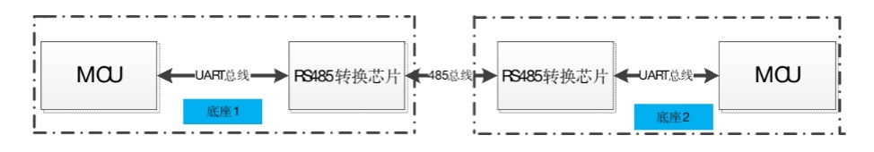

### 1.1.5.实验步骤

- 1.在geogle浏览器输入网址：https://iiot.stepiot.com 打开网站。

- 2.输入帐号。登陆网站。

- 3.点开,事物管理->开放API。
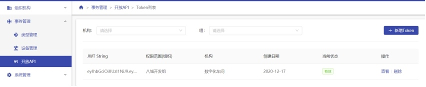

- 4.点击查看按钮，查看到token，将token复制保存。
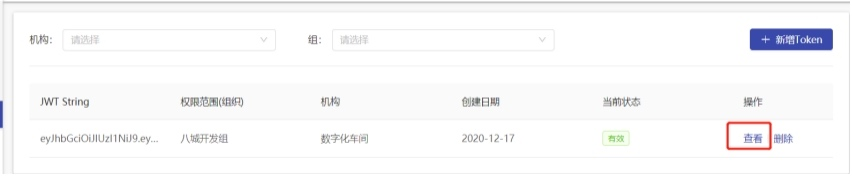
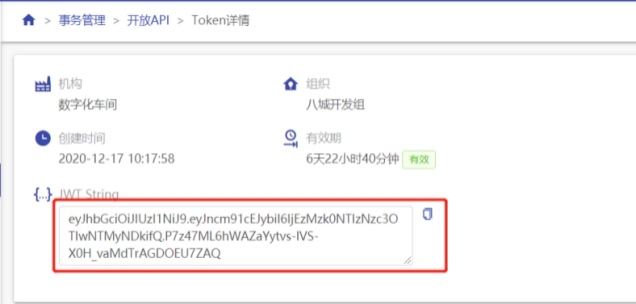

- 5.将WiFi模块、LED模块分别安装在STM32底座上。确认各个节点，如下图所示，ST_LINK连接WIFI节点连接。
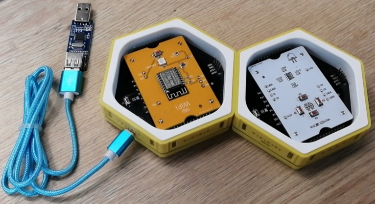

- 6.打开目录： D:\实验代码与教程\控制智慧教室\代码\WIFI\USER，找到WiFi.uvprojx工程文件，如下图，双击启动工程。
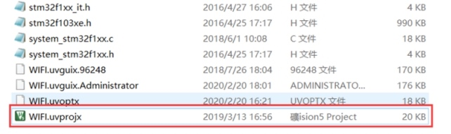

- 7.打开http_utils.h,填写token。
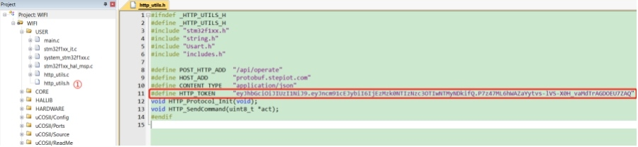

- 8.打WIFI.h，修改WIFI热点的名字与密码。如下图。
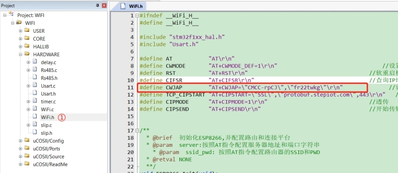

- 9.编译工程，然后将程序下载到WIFI节点的底座。
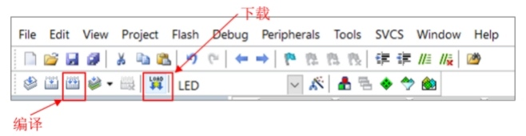

- 10.将STLink连接到按键节点。
- 11.打开目录：D:\实验代码与教程\控制智慧教室\代码\KEY\USER，找到LED.uvprojx。双击启动工程。
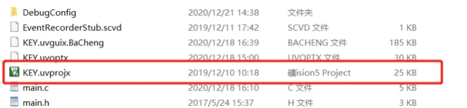

- 12.编译工程，然后将程序下载到节点底座中。如下图。
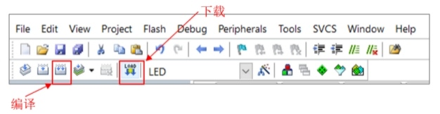

- 13.LED节点与WIFI节点拼接，从STM32底座上取下STLink的USB线在重新接上，给设备重新上电。
- 14.按键S1 控制灯，打开或者关闭。
按键S2 控制门锁，打开或者关闭。
按键S3 控制窗帘，闭合或者打开。

### 1.1.6.代码讲解-按键节点
- 1.程序目录结构。如下图。CORE文件夹为STM32内核代码，HALLIB文件文件夹为底层HAL库文件。我们主要关心，main.c及HARDWARE中的代码。
    - slip协议是在按键节点与WIFI节点之间使用的通信协议。
    - uCOSII，是实时操作系统。
    
    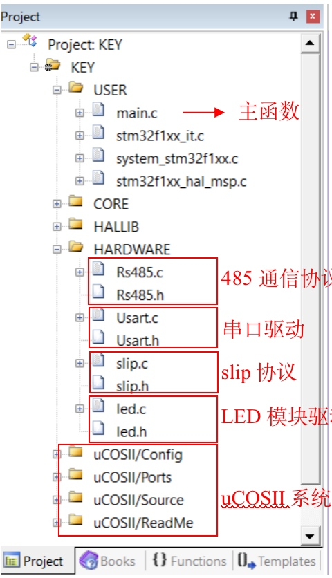

- 2.main.c->main.c中初始化UCOSII、启动开始任务Start_Task()。
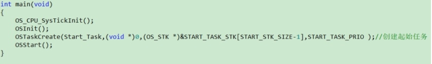

- 3.main.c-> Start_Task()中，中对串口、LED模块、RS485协议进行初始化。初始化完成后。创建按键扫描任务CC_Task()及485同步通信任务Sync_Task()。
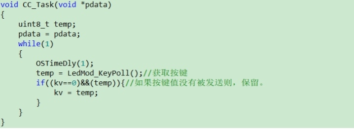
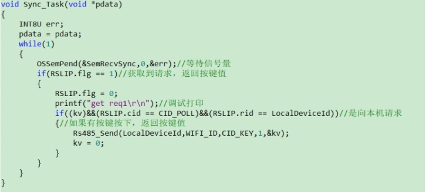

### 1.1.7.代码讲解-WIFI节点
- 1.程序目录结构。如下图。CORE文件夹为STM32内核代码，HALLIB文件文件夹为底层HAL库文件。我们主要关心，main.c、http_utils.c及HARDWARE中的代码。
    - 其中，slip协议是在按键节点与WIFI节点之间使用的通信协议。
平台联动代码，智慧教室平台与蜂巢套件之间使用http协议进行通信控制，平台联动代码是两者之间的接口。
    - uCOSII，是实时操作系统。
     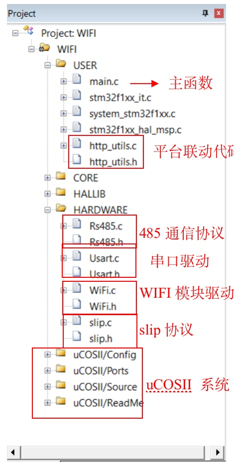

2)main.c->main(),初始化UCOSII系统，启动开始任务Start_Task()。
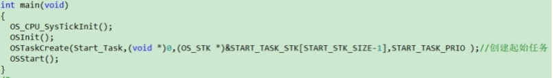

- main.c->Start_Task()任务中，初始化串口、WIFI模块(连接平台)、slip协议，并启动Sync_Task任务。

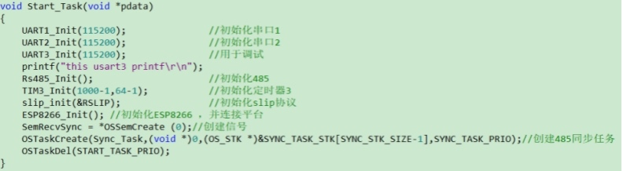

- main.c->Sync_Task任务,定时请求按键，并依据按键值控制灯、门锁及窗帘。

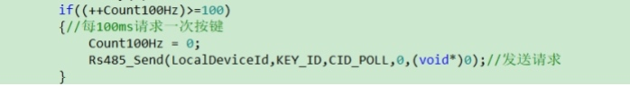
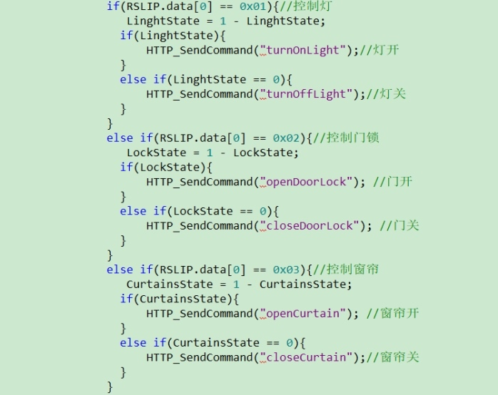

### 1.1.8.常见问题
- 1.弹出警告窗口，不能下载程序。
    - 请确认STLink驱动、STM32F103C8的DFP包是否安装。
    - STLink仿真器是否正常接入。
- 2.下载代码后程序没观察到实验现象。
    - 请重新上电，或者按下底座上的复位按键。
    - 模块没有安装稳妥。
- 3.连接不了平台设备没有上线。
    - WIFI名字、WIFI密码、token是否有效正确。
